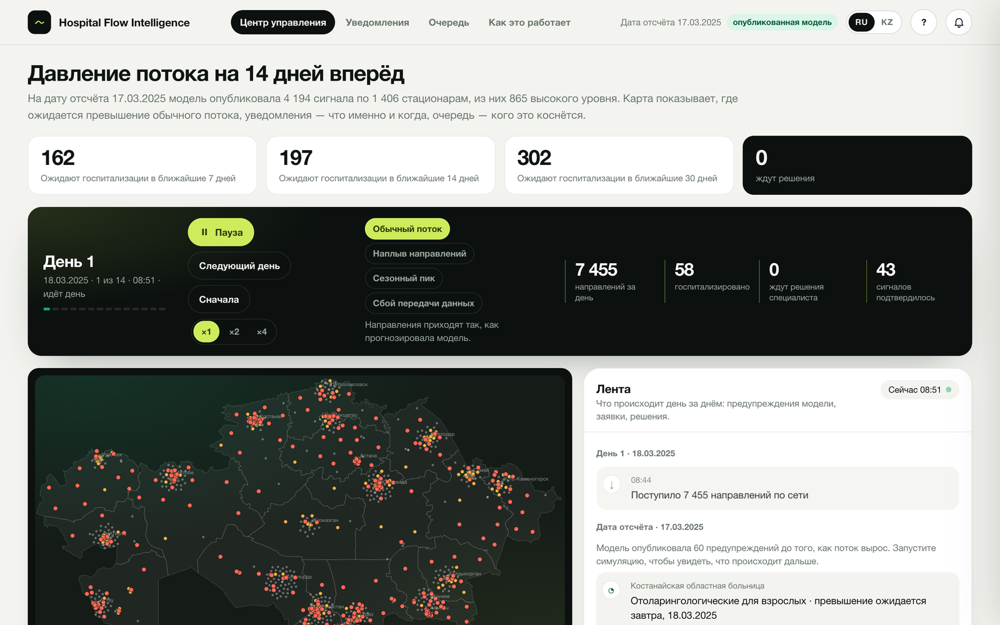
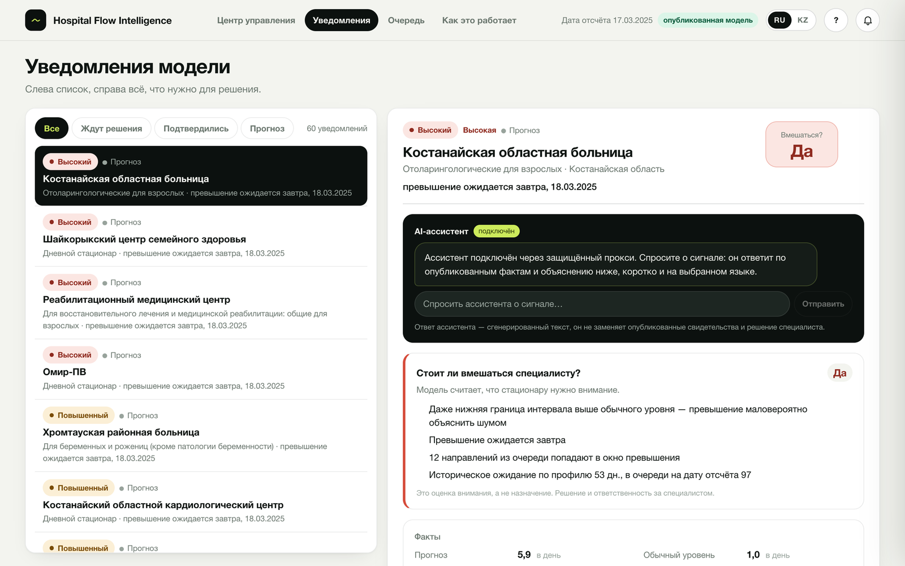
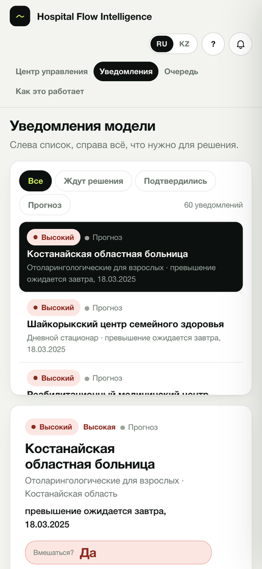
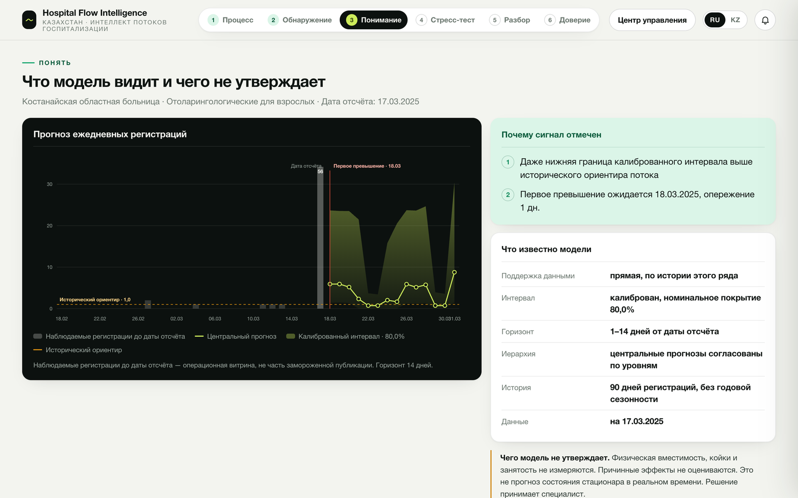

# Aqyl Kezek · Hospital Flow Intelligence

**The queue is visible two weeks before it forms.** A decision-support system for planned hospitalization in
Kazakhstan: it forecasts referral flow for every hospital × profile pair 14 days ahead, publishes calibrated
*flow-pressure* signals with the first day the flow exceeds its own historical norm, and gives the specialist a
screen where every signal ends in a recorded human decision.

Built on Ministry of Health open data for GovTech Camp 2026, Case 1 "Hospital load", by team **BizAI**.

> **The model warns. People decide.** Nothing here assigns, reroutes or schedules a patient, counts beds or
> promises an admission date. Every published capability carries `human_review_required = true` and
> `autonomous_action = false`, and the UI is tested against that vocabulary.



## What it does

| | |
|---|---|
| **Live map of 1 406 hospitals** | every dot coloured by its published signal level; a synthetic day unfolds hour by hour and the clock stops whenever the model needs a human |
| **14-day pressure forecast** | for each of 6 537 hospital × profile flows: central forecast, calibrated 80 % interval, first exceedance day, lead time, deterministic inbox rank |
| **Inbox and decision** | verdict *yes / no / unclear* with reasons, facts ledger, plain-language explanation, AI assistant that explains and never advises; accept / decline / request data, stored with the publication hash |
| **Six-scene story** | how one real signal travels from data to decision: flow, detect, understand, stress-test, review, trust |
| **Model passport** | 13 assured capabilities with verdicts, support tiers and SHA-256 identity; the ML core is frozen and every number on screen is reproducible |
| **Two languages** | Russian and Kazakh across the whole interface, phone to desktop |

<p align="center"></p>

## Quickstart

```bash
make up                          # postgres + FastAPI + nginx, waits until healthy
open http://localhost:3000       # the product
open http://localhost:8000/docs  # the API (38 operations, OpenAPI)
```

Demo path, one minute: **Запустить** → the clock stops on «Нужен специалист» → **Подробнее** → **Принять** →
**Уведомления** → **Как это работает**. `make down` stops everything; the `pgdata` volume keeps the database.

The AI bubble needs a provider key in `.env` (`ASSISTANT_PROVIDER=groq`, `ASSISTANT_API_KEY=…`,
`ASSISTANT_MODEL=openai/gpt-oss-120b`; OpenRouter, Gemini and OpenAI work the same way). The key never leaves the
server: the browser talks only to `POST /api/v1/assistant`. Without a key the bubble says it is not connected and
everything else works.

<details>
<summary>From scratch: data → models → evidence → publication</summary>

Prerequisites: Python ≥ 3.12, Docker, Node.js ≥ 22 (frontend only), the raw datasets under `data/raw/`
(`1 dataset` … `8 dataset`, read-only). On macOS LightGBM needs `brew install libomp`.

```bash
python3 -m venv .venv && .venv/bin/pip install -r requirements.txt
cp .env.example .env             # POSTGRES_PASSWORD, DEMO_API_KEY, optional assistant key
make up
make ingest                      # DuckDB → Parquet → PostgreSQL (dictionaries, facts, daily aggregates)
make train && make predict       # models A / B / C, batch predictions, serving marts
make flow-evidence flow-quantile flow-calibration flow-hierarchy flow-pressure signal-prioritization
make flow-scenario decision-alternatives   # stress tests and constrained alternatives (evaluation-only)
make tournament                  # patient-journey tournament (7 / 14 / 30-day probabilities)
make model-assurance             # the passport
make assurance-publish operational-intelligence-publish review-evidence-publish   # load evidence for the API
make audit                       # 13 repository gates
```

Every pipeline accepts `ARGS="--plan"` (read-only) and `ARGS="--resume <run-id>"`.
</details>

## How the model warns

```
open data ─► daily flows (6 537 hospital × profile) ─► features known at the origin day
   ─► LightGBM quantiles p10 / p50 / p90, horizons 1–14 ─► conformal calibration (80 % interval)
   ─► bottom-up hierarchy hospital → region → country ─► threshold = 90th percentile of the series, 56 days
   ─► signal WATCH / ELEVATED / HIGH, first exceedance, lead time ─► lexicographic inbox rank (no learned weights)
   ─► evidence: explanation, stress test ×0.9 / 1.1 / 1.2, constrained alternatives or abstention
   ─► specialist: accept · decline · request, logged with the publication hash
```

| Model | Question | Algorithm | Quality (time-only validation) | Status |
|---|---|---|---|---|
| Flow, quantiles | referrals per day, 14 days, p10 / p50 / p90 | LightGBM, quantile loss | WIS80 0.69 → 0.57, interval error −18 % | **in product** |
| Flow, point | mean referrals per day | Poisson LightGBM vs 5 baselines | WAPE 63 % vs 86 % seasonal naive | evidence |
| Admission by 7 / 14 / 30 days | probability a referral is admitted in time | XGBoost AFT (time-to-event) | C-index 0.85, calibration error 0.01 | accepted |
| Admission by 7 / 14 / 30 days | same question, second approach | discrete daily hazard | C-index 0.80 | accepted |
| Three outcomes | admitted / refused / waiting | Aalen–Johansen, no training | reference | accepted |
| Three outcomes, ML challenger | beat the reference | discrete competing risks | did not | rejected |
| Wait per referral | days until admission | LightGBM regression | MAE 10.5 vs 11.1 days | accepted |
| Refusal risk per referral | probability of refusal | LightGBM classification | ROC-AUC 0.79, calibrated within 1 pp | accepted |

Only temporal validation: training on January–February 2025, rolling origins 16.02 / 23.02 / 02.03, and an untouched
final-test origin 17.03.2025 that never selects a model, feature or calibrator. Calibrated interval coverage is
83 % on validation and **70 % on the final test** against a nominal 80 %: three months of data give no seasonality,
and the gap is shown, not hidden. Warning recall over 14 days 0.68, hospital-level precision 0.39.

Every run writes a manifest with data, config, code and artifact hashes; the passport identity
`f504defefdd87bcbb01c670b68469ba4c0e016be7f40ca89452baf69b73f39f5` is the SHA-256 of its canonical JSON and
reproduces from the versioned configuration on any day. Details: [docs/model_card.md](docs/model_card.md),
[docs/model-assurance-6b5.md](docs/model-assurance-6b5.md), [docs/project-evidence-index.md](docs/project-evidence-index.md).



## Architecture

Modular monolith, four layers, one direction of dependencies ([ADRs](docs/adr)):

```
ml/         offline only: ingest, features, models, flow chain, tournament, scenario engine, decision
            alternatives, assurance — LightGBM, XGBoost, DuckDB, Parquet, SHAP; never imported by the API
backend/    FastAPI + SQLAlchemy + Alembic (11 migrations, 31 tables); X-API-Key with viewer / specialist / admin
            roles, access log, idempotent decisions, assistant proxy; OpenAPI contract → generated TS types
frontend/   React 18 + Vite + TypeScript, TanStack Query, inline SVG map (OSM 2022 borders, 215 geocoded towns),
            seeded simulation reducer, RU / KK i18n, no scientific computation in the browser
db/ tools/  PostgreSQL init; tools/audit.py = 13 gates run by `make audit` and CI
```

The shared boundary between ML and API is the database: evidence is loaded into read models
(`operational_*`, `review_*`, `model_assurance_*`) by an explicit publish step, and the UI reads only those.
Decisions land in `specialist_decision` with the simulation `run_id`, so a restart forgets the previous answers on
screen while the table keeps them as history.

## Data

Ministry of Health open data, Q1 2025: 767 130 referrals for planned hospitalization (IS BG), 1.51 M admission-unit
refusals, ERSB treated cases per organization, 1 406 hospitals in 20 regions. No names or national IDs; the product
shows pseudonymous synthetic requests on top of real signals and labels every synthetic element. Cleaning rules,
dictionaries and every derived column: [docs/data.md](docs/data.md).

## Verification

```bash
make audit          # layout, secrets, architecture, OpenAPI contract, alembic, ruff, pytest, docs, auth,
                    # web contract, web lint, web build, bundle secret scan
make test           # 128 backend tests      make web-test   # 34 frontend tests
```

CI runs the same gates on every push. Security model, what the prototype protects and what production must add
(SSO, TLS, secret manager, tamper-evident audit): [docs/security.md](docs/security.md).

## Limits, honestly

- Three months of history: no annual seasonality; interval coverage 70 % on the final test.
- One retrospective origin (17.03.2025): not a live forecast, freshness is `UNKNOWN` until an SLA exists.
- No bed, occupancy or staffing data: the signal is *flow pressure*, not overload.
- The 7 / 14 / 30-day admission models are accepted but not yet on screen: they need a daily referral feed.
- Decision alternatives take 6.7 h on a laptop and are evaluation-only.

## Team

**Izbassar Orynbassar** — applied data science, software engineering · **Madina Sissenbay** — technical
coordination, project management. Team BizAI, GovTech Camp 2026.

Documentation index: [docs/](docs) · API: [docs/api.md](docs/api.md) · Product: [docs/demo-frontend-handoff.md](docs/demo-frontend-handoff.md)
