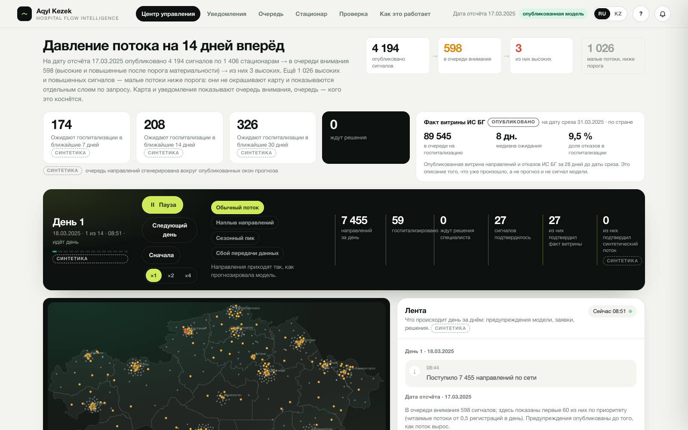
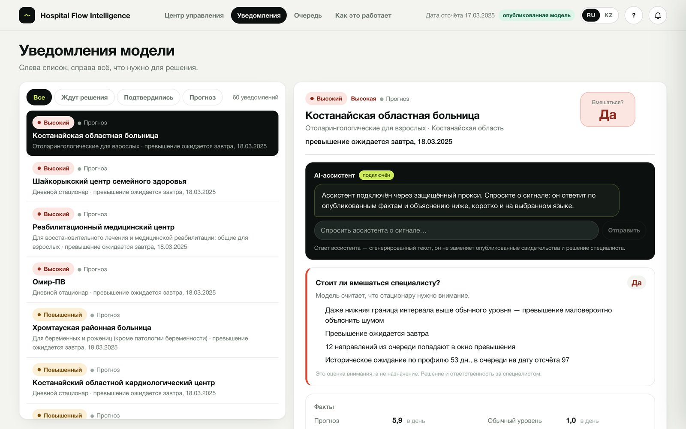
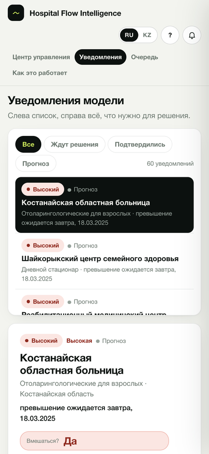
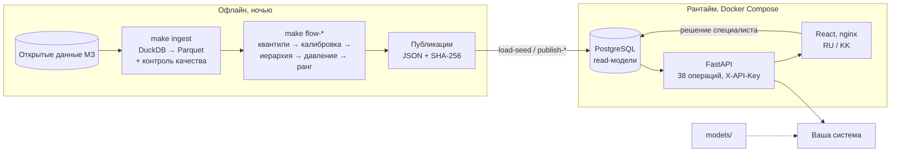

# Aqyl Kezek · Hospital Flow Intelligence

**Модель предупреждает. Решает человек.**

GovTech Camp 2026, трек AI GovTech, **Кейс 1 «Нагрузка на стационары и очереди на госпитализацию»**. Команда BizAI.

Система прогнозирует поток направлений на плановую госпитализацию по каждой паре «стационар × профиль» на 14 дней
вперёд, сравнивает прогноз с собственной исторической нормой ряда и поднимает специалисту сигнал с датой, когда
поток превысит норму. Специалист принимает, отклоняет или запрашивает данные — решение сохраняется вместе с хешем
публикации, по которому потом можно восстановить, какие именно цифры человек видел.



## Запуск

Нужны git, GNU make и Docker с плагином compose. Ни Python, ни Node, ни доступа к данным Минздрава не требуется.

```bash
git clone https://github.com/IzbassarO/hospital-queue-ai.git
cd hospital-queue-ai
make demo
```

Та же ветка `main` лежит и в репозитории сдачи: https://github.com/BAITC-Hacks/hack-043b4fcc-bizai

Мы засекли дважды на чистой копии: 7 минут 41 секунда, когда Docker скачивает и собирает всё с нуля, и
3 минуты 47 секунд, когда образы уже в кэше. Почти всё это время — сборка. В конце `make demo` проверяет сам
себя (`make smoke`) и печатает адреса:

```
  liveness      ok
  publication   operational-intelligence-slice5-final-test-2025-03-17-v1 (4194 signals, 225680 forecast rows)
  passport      ok
  evidence      ok
  UI            HTTP 200
UI       http://localhost:3000
API docs http://localhost:8000/docs
```

`make demo` — это `make env` (создаёт `.env` со случайным паролем базы и демо-ключом; существующий файл не трогает),
затем `make up`, затем разовый контейнер `seed`, который загружает опубликованные свидетельства. Обычный `make up`
данные не трогает. Если порты заняты, поменяйте `FRONTEND_PORT`, `API_PORT`, `POSTGRES_PORT` в `.env`. База и API
слушают только localhost; наружу смотрит лишь интерфейс. `make` без аргументов покажет список целей.

Демо-путь на минуту: **Запустить** → часы останавливаются на «Нужен специалист» → **Подробнее** → **Принять** →
решение появляется в журнале. Интерфейс полностью на русском и казахском.

<p align="center"></p>

## Что работает сейчас

Карта всех 1 406 стационаров, окрашенная по опубликованным сигналам. Входящие уведомления с детерминированным
рангом. Очередь направлений и журнал решений. Паспорт модели с хешами. История одного сигнала из шести сцен.
AI-ассистент, который объясняет опубликованные факты и не даёт советов; без ключа провайдера он честно говорит, что
не подключён, и всё остальное продолжает работать.

На дату отсчёта 17.03.2025 опубликовано 4 194 сигнала. Состав важно называть точно:

| Что это | Сколько |
|---|---|
| Прогноз давления потока, выше порога материальности: HIGH | 3 |
| Прогноз давления потока, выше порога материальности: ELEVATED | 90 |
| Аномалии уже наблюдённого потока (отдельный детектор) | 505 |
| **Итого во входящих у специалиста** | **598** |
| Наблюдение (WATCH) выше порога | 2 428 |
| Отсечено порогом материальности (нулевая норма, меньше 1 направления в день) | 1 047 |
| Без порога, очередь качества данных | 121 |

Порог материальности убирает ряды, у которых историческая норма нулевая, а прогноз меньше одного направления в
день: формально они дают HIGH, но тревожить ими специалиста бессмысленно. Из 93 прогнозных сигналов 42 приходятся
на профиль «Дневной стационар», у 53 норма не выше одного направления в день. Стационары с хронически длинной
очередью (Алматы, ГКБ № 1, кардиология: 719 ожидающих) в эту очередь не попадают по построению — сигнал реагирует на
изменение относительно нормы самого ряда, а хронический уровень показывает витрина индекса нагрузки.

## Данные

Открытые данные Минздрава РК за I квартал 2025 года: 767 130 направлений на плановую госпитализацию (ИС БГ),
1 508 732 отказа приёмных отделений, снимок ЕРСБ, список ожидающих. 1 406 стационаров, 20 регионов, 97 профилей,
6 537 дневных рядов «стационар × профиль». Имён и ИИН в наборах нет, и конвейер их не ожидает. На 31.03.2025 в
очереди 89 545 направлений, медиана ожидания 8 дней (в Жетісу 13), за 28 дней 18 816 отказов, то есть 9,5 %.

Сырые файлы (17,1 ГБ, 119 штук) в репозиторий не входят — их выдают организаторы. Чтобы проверяющий мог сверить свою
копию, мы положили `docs/raw-manifest.json`: размер, SHA-256, заголовок и число строк каждого файла, плюс отметка,
читает ли его конвейер. Из выданного мы используем 2,2 ГБ (наборы 1–4); вакцинацию и онкологию не трогали, потому
что связать их с направлениями нечем. Проверка своей копии — одна команда:

```bash
python tools/raw_manifest.py --verify docs/raw-manifest.json
```

Перед тем как что-то станет Parquet, данные проходят контроль качества (`ml/hqai_ml/ingest/quality.py`): контракт на
колонки и типы, формат кодов, окно правдоподобия дат, порядок «регистрация → исход», дубликаты, доля дневного
стационара. На текущих данных это 125 проверок по 10 таблицам, 3 032 300 строк, статус PASS. Жёсткое нарушение
останавливает загрузку, и старый слой данных остаётся на месте. Отчёт можно получить, ничего не перезагружая:
`python ml/pipelines/ingest.py --check-quality`.

## Модели

Проверка только по времени: обучение на январе–феврале 2025, скользящие даты отсчёта 16.02 / 23.02 / 02.03 и
нетронутый финальный срез 17.03.2025, который никогда не выбирает модель, признак или калибратор.

| Модель | Вопрос | Алгоритм | Качество | Статус |
|---|---|---|---|---|
| Квантили потока | направлений в день на 14 дней, p10/p50/p90 | LightGBM quantile + конформная калибровка + иерархия снизу вверх | WIS80 0,69 → 0,57; покрытие 83 % на валидации и 70 % на финальном тесте при номинале 80 % | в продукте |
| Точечный прогноз потока | среднее число направлений в день | Poisson LightGBM против пяти простых методов | WAPE 63 % против 86 % у сезонного наивного | не продвинут |
| Госпитализация к 7/14/30 дням | вероятность успеть в срок | XGBoost AFT | C-index 0,85, ошибка калибровки 0,01 | принята |
| Госпитализация к 7/14/30 дням | тот же вопрос, другой подход | LightGBM, дискретный hazard | C-index 0,80 | принята |
| Три исхода | госпитализирован / отказ / ждёт | Aalen–Johansen, без обучения | эталон | принята |
| Три исхода, ML-претендент | обойти эталон | дискретные конкурирующие риски | не обошёл | отклонён |
| Ожидание по направлению | дней до госпитализации | LightGBM регрессия | MAE 10,5 против 11,1 у правила; Spearman 0,73 против 0,70 | принята |
| Риск отказа | вероятность отказа | LightGBM классификация | ROC-AUC 0,79 при 0,76 у базового правила | принята |

Качество предупреждений на ретроспективе, горизонт 14 дней: полнота 0,68, точность 0,39 на уровне стационара. Порог
выбран в сторону полноты — пропущенное превышение дороже лишнего взгляда.

Точечная Poisson-модель проиграла обычному среднему по тому же дню недели в пяти ячейках валидации из шести, поэтому
в продукт пошли квантили, а точечный прогноз остался свидетельством. Производный прогноз очереди оказался хуже, чем
просто оставить последнее известное значение, и мы его не показываем — в API об этом написано прямо. ML-модель для
трёх исходов не обошла оценку Аалена–Йохансена, статистику без обучения, и была отклонена по правилу турнира.

Паспорт модели (`docs/model-assurance-6b5.md`) содержит 13 возможностей: 10 приняты, 2 приняты с замечаниями
(стресс-тест и математические альтернативы — только для оценки), 1 не продвигается. Идентичность паспорта
`f504defe…39f5`, операционной публикации `43da33ec…5cfd`, свидетельств для разбора `e07be2f1…3c22`. Эти же значения
видны в интерфейсе и возвращаются API, так что любую цифру на экране можно проследить до принятого прогона.

### Модели как модули

Папка `models/` самодостаточна: скачайте её отдельно от репозитория и используйте где угодно. Шесть моделей в родном
формате (LightGBM `model.txt`, XGBoost `model.json`), рядом `predict.py` (CSV на входе, CSV на выходе), контракт
признаков, категории, метрики, пример входа и ожидаемый выход, у пяти из шести ещё и `bundle.joblib`. Зависимости —
только lightgbm или xgboost, pandas и numpy. SHA-256 каждого файла лежит в `models/manifest.json`.

```bash
python models/refusal_risk/predict.py --input referrals.csv --output scored.csv
```

Мы проверили это так, как проверял бы посторонний: скопировали две папки за пределы репозитория и запустили с пустым
`PYTHONPATH`. Предсказания совпали с приложенными эталонными до 1e-16. Бустеры квантильной модели в принятом прогоне
не сохранялись, поэтому мы переобучили их тем же кодом на дате отсчёта 17.03.2025 и сверили с опубликованными
квантилями: расхождение 0,0 на 47 782 ячейках.

### Синтетический слой

Очередь заявок `Н-####`, симуляция дня и сценарии лежат целиком в `frontend/src/synthetic/` — два JSON и генератор,
подключённые одной строкой. На экране всё это подписано словом «синтетика», а сборка `make web-build-off` убирает
слой совсем. В опубликованные прогнозы, пороги, уровни, даты превышения и ранги синтетика не попадает.

## Архитектура

Модульный монолит, одно направление зависимостей: `ml → база ← backend ← frontend`. Backend никогда не импортирует
ML-код, ML никогда не выполняется внутри HTTP-запроса, схема базы меняется только миграциями Alembic. Свидетельства
попадают в read-модели отдельным явным шагом публикации. Правила записаны в ADR 0001–0007 и проверяются
`tools/architecture_check.py` на каждом прогоне CI.


```mermaid
flowchart LR
  subgraph offline["Офлайн, ночью"]
    raw[(Открытые данные МЗ)] --> ingest[make ingest<br/>DuckDB → Parquet<br/>+ контроль качества]
    ingest --> chain[make flow-*<br/>квантили → калибровка →<br/>иерархия → давление → ранг]
    chain --> bundles[Публикации<br/>JSON + SHA-256]
  end
  subgraph runtime["Рантайм, Docker Compose"]
    bundles -->|load-seed / publish-*| pg[(PostgreSQL<br/>read-модели)]
    pg --> api[FastAPI<br/>38 операций, X-API-Key]
    api --> ui[React, nginx<br/>RU / KK]
    ui -->|решение специалиста| pg
  end
  api --> ext[Ваша система]
  models[models/] -.-> ext
```

- `ml/` — Python 3.12+, DuckDB, LightGBM 4.7, XGBoost 3.4, scikit-learn, SHAP. Каждый прогон пишет манифест с
  хешами данных, конфигурации, кода и артефактов и продолжается после обрыва. 396 тестов без базы.
- `backend/` — FastAPI, SQLAlchemy 2, Alembic: 13 миграций, 32 таблицы, 38 операций OpenAPI, роли viewer /
  specialist / admin, журнал доступа, идемпотентные решения, экспорт XLSX и PDF, серверный прокси ассистента.
  153 теста; каждый эндпоинт отвечает быстрее 70 мс на текущих данных.
- `frontend/` — React 18, Vite, TypeScript, TanStack Query, карта на inline SVG. Никаких научных расчётов в
  браузере. 48 тестов.
- `seed/` (30 МБ) — то, что делает чистый клон работающим: три публикации байт в байт и сервисные таблицы по всем
  20 регионам. Направления уровня записи — срез по двум регионам, чтобы проверять API.

## Интеграция

Три способа встроить систему описаны в [docs/integration.md](docs/integration.md): как сервис рядом с вашими
системами по контракту `backend/openapi.json`; как ML-модули из `models/` внутри вашего кода; как данные — три
JSON-публикации со схемой и хешами грузятся в ваш PostgreSQL одной командой. Интернет в рантайме не нужен, ассистент
опционален и переключается на модель внутри страны одной настройкой.

## Проверка

```bash
make audit      # 14 ворот: структура, секреты, ARCH001–005, контракт OpenAPI, дрейф Alembic,
                # ruff, тесты backend и ML, документация API, авторизация, фронтенд
make test       # 153 теста API        make ml-test   # 396 тестов ML
make web-test   # 48 тестов интерфейса make smoke     # живой стек отвечает и публикации на месте
```

CI гоняет на каждый push четыре задания: `backend` (миграции, фикстура двух регионов, витрины, полный аудит),
`demo-seed` (чистая база, загрузка `seed/`, проверка идентичностей через API), `frontend` (Vitest) и `docker-images`
(сборка обоих образов). Сейчас все 14 ворот зелёные.

## Ограничения

Три месяца данных — годовой сезонности модель не видела и не заявляет. Одна ретроспективная дата отсчёта вместо
живой ленты. Покрытие интервала на финальном тесте 70 % при обещанных 80 %: хуже всего на выходных (59,7 %) и в
праздники (66,7 %), и мы показываем это, а не прячем. Данных о койках и персонале в открытых наборах нет, поэтому
сигнал называется «давление потока», а не «перегрузка». Модели на 7/14/30 дней приняты, но на экран не выведены — им
нужна ежедневная выгрузка направлений. Математические альтернативы считаются 6,7 часа на ноутбуке и пригодны только
для разбора человеком. В прототипе нет TLS и SSO; демо-ключ подставляет nginx, поэтому доступ к порту интерфейса
равен доступу к данным.

## Что нужно до запуска в контуре

- **Данные.** 21 месяц истории ради сезонности, ежедневная выгрузка направлений и исходов, коечный фонд и штаты.
  Ожидаемый результат: покрытие интервала выше 78 % и медианный запас времени не меньше пяти дней.
- **Инфраструктура.** Один сервер 8 vCPU / 32 ГБ, ночной пересчёт меньше двух часов на дату отсчёта, объектное
  хранилище для артефактов, языковая модель внутри страны либо отказ от ассистента.
- **Безопасность** ([docs/security.md](docs/security.md) §4). SSO ведомства вместо общего ключа, TLS, менеджер
  секретов, разделение ролей PostgreSQL, журнал с защитой от подмены и выгрузкой в SIEM, пентест.
- **Продукт.** Живая дата отсчёта, вероятности госпитализации на экране, пилот в двух регионах с измеряемыми
  показателями. Целевые «8 → 7 дней» и «9,5 % → 8 %» — гипотезы пилота, а не измеренный эффект.
- **Мониторинг** ([docs/monitoring.md](docs/monitoring.md)). Метрики и их базовые значения уже посчитаны, пороги
  тревог задаются по первым неделям пилота.

## Как шла работа

Код писался с 14 по 27 сентября: 43 коммита к 24-му и упаковка репозитория после. Недели 1–2 восстановлены по плану
программы.

| Неделя | Даты | Что сделали |
|---|---|---|
| 1 | 3–6 сен | Старт программы, разбор кейсов, выбор Кейса 1, сбор команды. <!-- подтвердить --> |
| 2 | 7–13 сен | Вебинары с ведомствами, получение датасетов, первое чтение данных, черновик архитектуры: монолит, PostgreSQL, офлайн ML. <!-- подтвердить --> |
| 3 | 14–20 сен | 14.09 скелет проекта, Postgres в Docker, ingest, инвентаризация. 15.09 модели ожидания, риска отказа и потока, временная валидация, SHAP, реестр, первый интерфейс, ключи и роли, журнал доступа, экспорт, CI. 16.09 архитектурный baseline, ADR 0001–0004, контракт OpenAPI. 17.09 воспроизводимые прогоны с манифестами, турнир «путь пациента». 18.09 цепочка потока: квантили, конформная калибровка, иерархия, давление; звонок с ML-инженером NITEC. 19.09 ранжирование сигналов, ADR 0005. 20.09 движок стресс-тестов, ADR 0006. |
| 4 | 21–27 сен | 21.09 движок ограниченных альтернатив с полной верификацией. 22.09 паспорт модели, заморозка ML-ядра, публикация read-моделей. 23.09 центр управления: карта, входящие, очередь, решения в базе, прокси ассистента, RU/KK. 24.09 README со скриншотами, презентация, речь и вопросы жюри. 26–27.09 подготовка к сдаче: `seed/` для чистого клона, `models/` как отдельные модули, вынос синтетики, контроль качества данных, манифест сырых файлов, план мониторинга, этот README. |
| 5 | 28 сен – 3 окт | Сдача репозитория 28.09, техническая защита 29.09, Digital Bridge 1–3 октября. |

## Кто что делал

| Кто | Что |
|---|---|
| Избасар Орынбасар | данные, ML, backend, frontend, инфраструктура — весь код |
| Мадина Сисенбай | техническая координация, управление проектом, связь с организаторами и ведомствами, сценарий демонстрации и презентация, проверка сценария специалиста <!-- подтвердить --> |

## Документация

[docs/architecture.md](docs/architecture.md) и [docs/adr/](docs/adr/) — границы и решения ·
[docs/api.md](docs/api.md) — 38 операций с примерами · [docs/data.md](docs/data.md) — источники и правила очистки ·
[docs/model_card.md](docs/model_card.md), [docs/project-evidence-index.md](docs/project-evidence-index.md) — модели
и принятые прогоны · [docs/integration.md](docs/integration.md), [docs/security.md](docs/security.md),
[docs/monitoring.md](docs/monitoring.md) — внедрение · [models/README.md](models/README.md),
[seed/README.md](seed/README.md), [frontend/src/synthetic/README.md](frontend/src/synthetic/README.md).

English version: [README.en.md](README.en.md). Лицензия: [MIT](LICENSE); данные Минздрава и производные от них
свидетельства под неё не подпадают.
