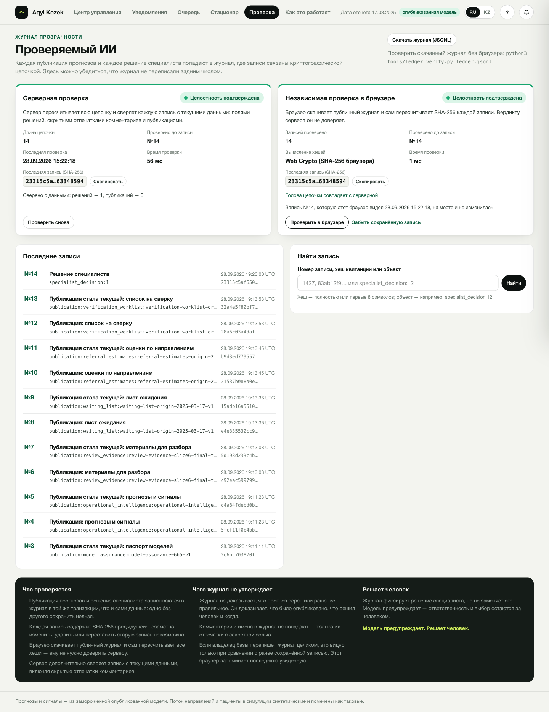

# Aqyl Kezek · Hospital Flow Intelligence

**Модель предупреждает. Решает человек.**

GovTech Camp 2026 · AI GovTech
Кейс: Нагрузка на стационары и очереди на госпитализацию
Команда BizAI

### Живой продукт: **https://bizai.govtech-kz.com**

Aqyl Kezek — AI-центр управления плановой госпитализацией. Он прогнозирует давление потока направлений по каждому
стационару и профилю на 14 дней вперёд, показывает, куда специалисту смотреть в первую очередь, помогает разобраться
в сигнале и проверить его на сценариях. Решение всегда остаётся за специалистом.


## Что умеет Aqyl Kezek

- **14 дней вперёд** — прогноз давления потока направлений
- **Приоритетные сигналы** — куда специалисту смотреть в первую очередь
- **AI-ассистент** — объясняет опубликованные факты на русском и казахском
- **Стресс-тест** — показывает, как меняется сигнал при изменении потока
- **Human in the Loop** — финальное решение принимает специалист
- **Проверяемый AI** — криптографически проверяемая история публикаций и решений

## Масштаб

| | |
|---|---|
| **767 130** | направлений за I квартал 2025 |
| **1 406** | стационаров |
| **89 545** | направлений в очереди на 31.03.2025 |
| **8 дней** | медианное ожидание |
| **14 дней** | горизонт прогноза |

Источник — открытые данные Минздрава РК. Имён и ИИН в наборах нет.

## Как это работает

**Данные → Прогноз → Сигнал → Проверка сценария → Решение специалиста → Проверяемая история**

Модели обучаются офлайн и публикуют прогнозы и сигналы на дату отсчёта (сейчас — ретроспективная 17.03.2025);
интерфейс показывает только опубликованное. Специалист разбирает сигнал, проверяет сценарий и принимает решение, а
система записывает его в журнал прозрачности.

Очередь заявок и симуляция дня в демонстрации синтетические и подписаны на экране словом «синтетика»; реальных
пациентов в продукте нет.

## Проверяемый AI

Каждая опубликованная версия и решение специалиста фиксируются в журнале прозрачности (transparency ledger). Сервер
сверяет записи с исходными данными, а браузер независимо пересчитывает цепочку SHA-256. Изменение уже записанной
истории обнаруживается при проверке. Журнал не утверждает, что прогноз верен, — он доказывает, что именно было
опубликовано и какое решение принято. Подробности и границы гарантий — в
[docs/transparency-ledger.md](docs/transparency-ledger.md).

<p align="center"></p>

## AI-ассистент

Ассистент подключён в продукте и объясняет опубликованные факты конкретного сигнала на русском или казахском.
Запросы идут через backend, ключ провайдера хранится только на сервере. Ассистент не принимает решений — их принимает
специалист.

## Запуск

```bash
git clone https://github.com/BAITC-Hacks/hack-043b4fcc-bizai.git
cd hack-043b4fcc-bizai
make demo
```

Интерфейс: http://localhost:3000

Для запуска нужны Git, Docker Compose и GNU Make.

## Технологии

Python · LightGBM · XGBoost · FastAPI · PostgreSQL · React · TypeScript · Docker · Groq

## Команда BizAI

**Избасар Орынбасар** — AI · данные · разработка
**Мадина Сисенбай** — продукт · техническая координация

## Техническая документация

**ML и свидетельства**

- [Квантильный прогноз потока на 14 дней](docs/flow-quantile-forecast.md) и [временная калибровка интервалов](docs/flow-temporal-calibration.md)
- [Иерархическое согласование прогнозов](docs/flow-hierarchy-forecast.md) и [сигналы давления потока](docs/flow-pressure-warning.md)
- [Приоритизация сигналов](docs/signal-prioritization.md) и [стресс-тесты](docs/flow-scenario-engine.md)
- [Паспорт моделей](docs/model-assurance-6b5.md), [карточка модели](docs/model_card.md) и [индекс свидетельств](docs/project-evidence-index.md)
- [Модели как отдельные модули](models/README.md)

**Платформа**

- [Архитектура](docs/architecture.md) и [архитектурные решения](docs/adr/)
- [API](docs/api.md) · [Данные](docs/data.md) · [Безопасность](docs/security.md)
- [Журнал прозрачности](docs/transparency-ledger.md)
- [Интеграция](docs/integration.md) · [Развёртывание](docs/deploy-shared-server.md) · [Эксплуатация](docs/operations.md)

Лицензия: [MIT](LICENSE). Данные Минздрава и производные от них свидетельства под неё не подпадают.
