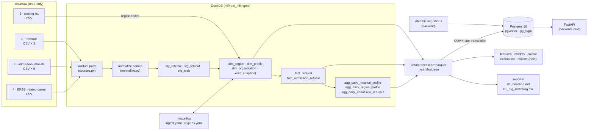

# Architecture

## Repository layout

```
hospital-queue-ai/
├── backend/            FastAPI app + database schema
│   ├── app/
│   │   ├── main.py         FastAPI app (only /health for now)
│   │   ├── core/config.py  settings (pydantic-settings, reads .env)
│   │   └── db/
│   │       ├── session.py  SQLAlchemy engine / session dependency
│   │       └── models.py   SQLAlchemy models of the data layer
│   ├── alembic/            migrations (schema owner)
│   ├── alembic.ini
│   └── pyproject.toml
├── ml/                 data & ML code
│   ├── hqai_ml/
│   │   ├── ingest/         implemented: raw → Parquet → Postgres
│   │   ├── features/       placeholder
│   │   ├── models/         placeholder
│   │   ├── causal/         placeholder
│   │   ├── evaluation/     placeholder
│   │   ├── explain/        placeholder
│   │   └── registry/       placeholder
│   ├── pipelines/          ingest.py, baseline.py
│   └── configs/            ingest.yaml, regions.yaml
├── frontend/           placeholder
├── db/init.sql         Postgres extensions (pgvector, pg_trgm)
├── docs/               this file, data.md
├── scripts/            00_inventory.py (step 1)
├── data/               raw/ (read-only input), processed/ (Parquet)   — gitignored
├── reports/            generated reports                               — gitignored
├── notebooks/          exploration                                     — gitignored
├── artifacts/          trained models etc.                             — gitignored
├── docker-compose.yml  postgres (pgvector/pgvector:pg16)
├── Makefile            up, down, migrate, ingest, baseline, psql
└── .env.example
```

## Responsibilities

- **Schema** is owned by Alembic in `backend/`. The ingest pipeline never creates tables; it
  truncates and reloads them. `make ingest` runs `alembic upgrade head` first.
- **Transformations** run in DuckDB inside `ml/hqai_ml/ingest`, reading CSV directly from
  `data/raw/`. The clean result is written to Parquet first (`data/processed/`), so analysis
  (`baseline.py`, notebooks) can run without a database and Postgres is a pure serving copy.
- **Postgres** serves the API (next steps). Load = one transaction: truncate all tables, stream
  every Parquet file with `COPY`, verify row counts, commit.
- **Manual dictionaries** that need human review live in `ml/configs/` and are versioned in git
  (`regions.yaml`); the pipeline regenerates them but preserves manual overrides.

## Data flow



## Runtime

| component | how it runs |
|---|---|
| Postgres | `docker compose` service `postgres`, image `pgvector/pgvector:pg16`, volume `pgdata`, healthcheck `pg_isready` |
| migrations | `make migrate` (also part of `make ingest`) |
| ingest | `make ingest` — ~15 s to Parquet, ~1.5 min including the Postgres load on a laptop |
| baseline | `make baseline` — reads Parquet only |
| API | `cd backend && uvicorn app.main:app` (only `/health` so far) |
