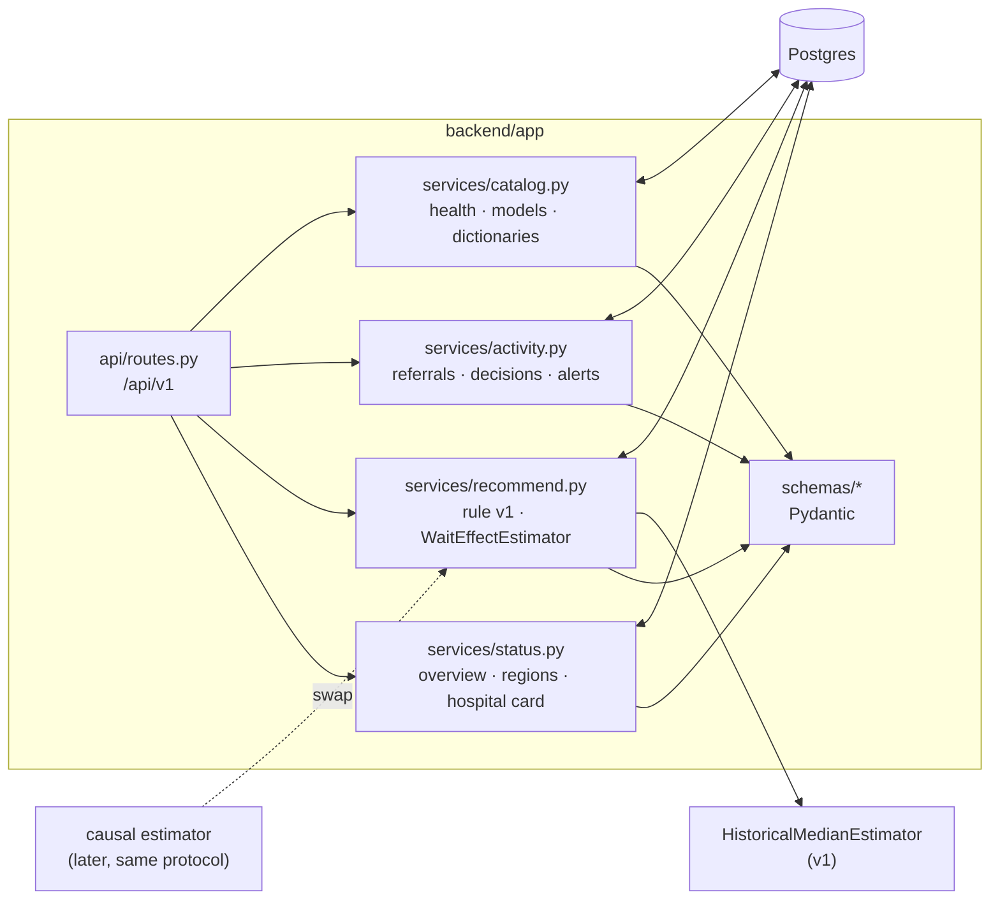
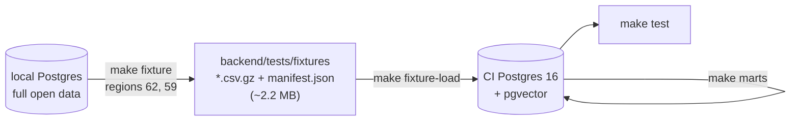

# Architecture

## Repository layout

```
hospital-queue-ai/
├── backend/            FastAPI service + database schema (docs/api.md)
│   ├── app/
│   │   ├── main.py         FastAPI app: /api/v1 router, CORS, access-log middleware, error handlers
│   │   ├── cli.py          create-key, seed-demo-key, list-keys, revoke-key (make create-key)
│   │   ├── core/config.py  settings (pydantic-settings, reads .env)
│   │   ├── core/security.py API-key authentication, roles viewer < specialist < admin (docs/security.md)
│   │   ├── core/access_log.py ASGI middleware: one access_log row per /api request
│   │   ├── api/            routers (routes.py) and dependencies (session, pagination)
│   │   ├── schemas/        Pydantic request / response models
│   │   ├── services/       status (overview, regions, hospital card), recommend (rule v1 + estimator
│   │   │                   interface), activity (referrals, idempotent decisions, alerts), catalog (health, me, config,
│   │   │                   models, dictionaries), display (display-ready explanation values), export (XLSX / PDF card),
│   │   │                   admin (API keys, access log)
│   │   └── db/
│   │       ├── session.py  SQLAlchemy engine / session dependency
│   │       └── models.py   SQLAlchemy models: data layer (incl. dim_icd), predictions, model registry (+ card), serving
│   │                           marts, decision_log, api_keys, access_log
│   ├── alembic/            migrations (schema owner): 0001 data layer, 0002 predictions, 0003 marts + decision_log,
│   │                       0004 excess queue trend, 0005 dim_icd + model cards + decision idempotency + api_keys +
│   │                           access_log
│   ├── tests/              API tests (pytest + httpx) against the running Postgres
│   │   └── fixtures/       2-region CI dataset (*.csv.gz + manifest.json, < 5 MB), built by tools/test_fixture.py
│   ├── Dockerfile          python:3.12-slim, non-root, alembic upgrade head + uvicorn
│   ├── alembic.ini
│   └── pyproject.toml
├── ml/                 data & ML code
│   ├── hqai_ml/
│   │   ├── ingest/         raw → Parquet → Postgres
│   │   ├── features/       referral features (A, B), series panels and horizon rows (C)
│   │   ├── models/         wait_time (A), refusal_risk (B), load_forecast (C)
│   │   ├── causal/         placeholder
│   │   ├── evaluation/     temporal split, metrics, backtest, report
│   │   ├── explain/        SHAP explanations with Russian templates
│   │   ├── registry/       artifacts/models/<name>/<version>/ + manifest.json
│   │   └── serving/        serving marts for the API: config (serving.yaml) + mart SQL
│   ├── pipelines/          ingest.py, baseline.py, train.py, predict.py, build_marts.py
│   └── configs/            ingest.yaml, regions.yaml, org_matches.yaml, models.yaml, explain_templates.yaml,
│                           serving.yaml (load_index weights, thresholds, recommendation rule)
├── frontend/           web UI (docs/frontend.md): React 18 + Vite + TypeScript
│   ├── src/api/            runtime-checked response schemas, fetch client, TanStack Query hooks
│   ├── src/pages/          Обзор, Регион, Карточка стационара, Сигналы, О моделях
│   ├── src/i18n/ru.ts      every user-visible string
│   ├── Dockerfile          node:22-alpine build → nginx:1.29-alpine
│   └── nginx.conf          static files, SPA fallback, /api → backend:8000
├── tools/              audit.py (make audit), test_fixture.py (make fixture / fixture-load)
├── .github/workflows/  ci.yml: lint + API tests on push and pull request
├── db/init.sql         Postgres extensions (pgvector, pg_trgm)
├── docs/               this file, data.md, model_card.md, api.md, frontend.md, security.md
├── data/               raw/ (read-only input), processed/ (Parquet)   — gitignored
├── reports/            generated reports                               — gitignored
├── notebooks/          exploration                                     — gitignored
├── artifacts/          trained models etc.                             — gitignored
├── scratch/            temporary / exploratory / verification files   — gitignored
├── backups/            make backup (pg_dump)                           — gitignored
├── docker-compose.yml  postgres (pgvector/pgvector:pg16) + backend (FastAPI, port 8000) + frontend (nginx, port 3000)
├── Makefile            up, down, migrate, ingest, baseline, psql, train, predict, registry, marts, create-key, backup,
│                       restore, api-dev, test, lint, fmt, audit, fixture, fixture-load, web-install, web-dev, web-lint,
│                       web-test, web-build
├── pyproject.toml      repository tool config (ruff)
└── .env.example
```

## Responsibilities

- **Schema** is owned by Alembic in `backend/`. The ingest pipeline never creates tables; it
  truncates and reloads them. `make ingest` runs `alembic upgrade head` first.
- **Transformations** run in DuckDB inside `ml/hqai_ml/ingest`, reading CSV directly from
  `data/raw/`. The clean result is written to Parquet first (`data/processed/`), so analysis
  (`baseline.py`, notebooks) can run without a database and Postgres is a pure serving copy.
- **Models** train from Parquet only and are versioned on disk (`artifacts/models`); `predict.py` writes
  the predictions of the current versions to Postgres and mirrors the versions into `model_registry`.
- **Postgres** serves the API. Load = one transaction: truncate all tables, stream
  every Parquet file with `COPY`, verify row counts, commit.
- **Serving marts** (`mart_*`) are derived inside Postgres by `ml/pipelines/build_marts.py` (`make marts`, also the
  last step of `make predict`) from the aggregates, facts and prediction tables, in one transaction, with the
  parameters of `ml/configs/serving.yaml` recorded in `mart_build_info`. Formulas: `docs/api.md`.
- **The frontend only talks to the API.** It is a static bundle served by nginx, which also proxies `/api` to the
  backend, so the browser sees one origin. It keeps no state besides the TanStack Query cache and the last actor
  name in `localStorage`; every response is validated against a schema mirroring `backend/app/schemas`.
- **The backend only reads tables** (plus writes `decision_log`, the human-in-the-loop record, `api_keys` and
  `access_log`, none of which any pipeline truncates). It has no ML dependencies; the image contains `backend/` only. Heavy per-row work (ranking, trends,
  medians) happens at mart build time so every endpoint stays well under 500 ms.
- **Scratch work** (project rule): every temporary, exploratory or self-verification file created by
  an agent or developer — scratch scripts, ad-hoc checks, test dumps, comparison outputs — lives under
  `scratch/` (gitignored) and nowhere else. Everything outside `scratch/` is product code, config,
  migrations, docs or tests that a maintainer would keep. The step-1 inventory script
  (`scratch/00_inventory.py`) is kept there as a one-off.
- **Explanation values for display** are formatted by the backend (`services/display.py`): the per-feature format
  comes from `ml/configs/explain_templates.yaml`, copied into `mart_build_info.config` by `make marts`, so the API
  (which has no access to `ml/`) formats values the same way as the model's Russian sentences.
- **Access control and audit** (docs/security.md): every route except the health checks declares a role dependency
  (`ViewerDep` / `SpecialistDep` / `AdminDep`, checked by `make audit`); the key's label and role go into
  `request.state`, and the access-log middleware writes one row per `/api` request after the response. Keys: SHA-256
  in `api_keys`; the demo specialist key from `DEMO_API_KEY` is seeded at container start and compiled into the UI.
- **Texts shown to users live with the data they describe**: model cards in `ml/configs/model_cards.yaml` (copied into
  each artifact as `card.json` and into `model_registry.card`), factor short labels in `explain_templates.yaml`, the
  data-source description and formula parameters in `serving.yaml` (`GET /config`). The frontend renders them and
  keeps only UI wording in `ru.ts`.
- **Exports** (`services/export.py`) reuse the card, recommendation and decision services, so a downloaded XLSX/PDF
  has the same numbers as the screen; PDF uses a TrueType font with Cyrillic glyphs (DejaVu Sans in the image).
- **Manual dictionaries** that need human review live in `ml/configs/` and are versioned in git
  (`regions.yaml`, `org_matches.yaml`); the pipeline regenerates `regions.yaml` but preserves manual overrides.

## Data flow

```mermaid
flowchart LR
    subgraph raw["data/raw (read-only)"]
        D1["1 · referrals<br/>CSV × 3"]
        D2["2 · waiting list<br/>CSV"]
        D3["3 · admission refusals<br/>CSV × 6"]
        D4["4 · ERSB treated cases<br/>CSV"]
    end

    subgraph duck["DuckDB (ml/hqai_ml/ingest)"]
        V["validate parts<br/>(sources.py)"]
        N["normalize names<br/>(normalize.py)"]
        STG["stg_referral · stg_refusal · stg_ersb"]
        DIM["dim_region · dim_profile<br/>dim_organization · ersb_snapshot"]
        FACT["fact_referral<br/>fact_admission_refusal"]
        AGG["agg_daily_hospital_profile<br/>agg_daily_region_profile<br/>agg_daily_admission_refusals"]
    end

    CFG["ml/configs<br/>ingest.yaml · regions.yaml"]
    PQ["data/processed/*.parquet<br/>_manifest.json"]
    PG[("Postgres 16<br/>pgvector · pg_trgm")]
    ALB["Alembic migrations<br/>(backend)"]
    MARTS["build_marts.py<br/>serving.yaml"]
    API["FastAPI /api/v1<br/>(backend container)"]
    USER["specialist<br/>(UI, /docs)"]
    TRAIN["train.py<br/>features → models A · B · C<br/>temporal evaluation · SHAP"]
    ART["artifacts/models<br/>versions + manifest.json"]
    PRED["predict.py"]
    REP["reports/<br/>01_baseline.md · 01_org_matching.csv<br/>02_models.md"]

    D1 & D3 & D4 --> V --> N --> STG
    D2 -- "region codes" --> DIM
    STG --> DIM --> FACT --> AGG
    CFG <--> DIM
    DIM & FACT & AGG --> PQ
    ALB --> PG
    PQ -- "COPY, one transaction" --> PG
    PQ --> REP
    PQ --> TRAIN --> ART
    TRAIN --> REP
    ART --> PRED
    PQ --> PRED
    PRED -- "pred_referral · pred_daily_forecast<br/>model_registry" --> PG
    PG -- "aggregates · facts · predictions" --> MARTS
    MARTS -- "mart_hospital_profile_status<br/>mart_region_profile_status<br/>mart_area_status · mart_build_info" --> PG
    PG -- "marts · series · predictions · registry" --> API
    API -- "POST /decisions → decision_log" --> PG
    WEB["frontend (nginx :3000)<br/>React UI, /api proxy"]
    API <--> WEB
    WEB <--> USER
```



## Serving and API



Endpoints, formulas and examples: [`docs/api.md`](api.md).

## Runtime

| component | how it runs |
|---|---|
| Postgres | `docker compose` service `postgres`, image `pgvector/pgvector:pg16`, volume `pgdata`, healthcheck `pg_isready` |
| API | `docker compose` service `backend` (`make up`): image built from `backend/Dockerfile` (python:3.12-slim + DejaVu fonts, non-root user), env from `.env` with `POSTGRES_HOST=postgres`, starts after the postgres healthcheck, runs `alembic upgrade head`, then `python -m app.cli seed-demo-key` (`DEMO_API_KEY`), then uvicorn on port 8000 (`API_PORT`), healthcheck `GET /health`. Docs at http://localhost:8000/docs |
| frontend | `docker compose` service `frontend` (`make up`): image built from `frontend/Dockerfile` (node:22-alpine builds the bundle with build arg `VITE_API_KEY` = `DEMO_API_KEY`, nginx:1.29-alpine serves it), port 3000 (`FRONTEND_PORT`), starts after the backend healthcheck, proxies `/api/` to `backend:8000` (re-resolving the service name, so a recreated backend keeps working), healthcheck `GET /healthz`. http://localhost:3000 |
| frontend (development) | `make web-dev` — Vite on port 5173 with hot reload, `/api` proxied to `localhost:8000` (`API_PROXY_TARGET` to change) |
| API (development) | `make api-dev` — uvicorn with auto-reload on port 8001 against the same Postgres |
| migrations | `make migrate` (also part of `make ingest`, `make predict`, `make marts`, and of the backend container start) |
| ingest | `make ingest` — ~15 s to Parquet, ~1.5 min including the Postgres load on a laptop |
| baseline | `make baseline` — reads Parquet only |
| train | `make train` — reads Parquet only; writes `artifacts/models/` and `reports/02_models.md` (~5 min) |
| predict | `make predict` — migrations, then current models → Postgres prediction tables (~2 min), then marts |
| marts | `make marts` — serving marts from facts, aggregates and predictions (~3 s) |
| registry | `make registry` — refresh `model_registry` (metrics, model cards) from the artifacts without predicting (< 1 s) |
| keys | `make create-key ROLE=… LABEL=…` (prints the key once); `python -m app.cli list-keys / revoke-key` |
| backup | `make backup` → `backups/hqai_<timestamp>.dump` (`pg_dump -Fc` inside the postgres container); `make restore FILE=…` (`pg_restore --clean --single-transaction`, asks for `yes` unless `CONFIRM=yes`) |
| tests | `make test` — API tests in-process against the running Postgres (`HQAI_API_BASE_URL=http://localhost:8000 make test` for the container) |
| lint | `make lint` (ruff check + format check) / `make fmt` (fix + format) on `backend/`, `ml/`, `tools/`; config in the root `pyproject.toml`, cache in `scratch/` |
| audit | `make audit` — before every commit, see below |
| CI | GitHub Actions `.github/workflows/ci.yml`, see below |

## Quality gates

**`make audit`** (`tools/audit.py`) prints one line per check and exits non-zero if any fails:

| check | fails when |
|---|---|
| layout | a tracked-candidate file (anything not matched by `.gitignore`, found without git) is outside `backend ml frontend db docs tools .github` or is a root file other than the config files (`README.md`, `Makefile`, `docker-compose.yml`, `requirements.txt`, `pyproject.toml`, `.gitignore`, `.env.example`, …) |
| secrets | a tracked candidate is a `.env` (not `.env.example`), or contains a private key, AWS / GitHub / Slack / `sk-…` / Google API key, a credential-like assignment (`password`, `secret`, `token`, `api_key` … with a literal value that is not a placeholder such as `change-me` or `${VAR}`) or a password in a URL. Gzipped fixtures are scanned decompressed. `scratch/` and the local `.env` are gitignored and therefore not candidates |
| alembic | `alembic check` reports drift between the SQLAlchemy models and the migrations |
| ruff | `ruff check` or `ruff format --check` fails |
| pytest | the API tests fail |
| web-lint | when `frontend/package.json` exists: `npm run lint` (ESLint + `prettier --check`) fails; also fails if `frontend/node_modules` is missing (`make web-install`) |
| web-build | when `frontend/package.json` exists: `npm run build` (`tsc -b` + Vite production build) fails |
| api-auth | a FastAPI route other than `/health` and `/api/v1/health` has no auth dependency (`__hqai_auth__` marker of `require_role`) in its dependency tree or router include |
| api-docs | an endpoint heading in `docs/api.md` (a `###` heading holding `` `METHOD /path` ``) has no route in the app's OpenAPI schema under `/api/v1`, or vice versa (path parameter names and query strings are ignored) |

**CI** (`.github/workflows/ci.yml`, on push and pull request), two jobs:

- `backend`: Ubuntu, Python 3.12, a `pgvector/pgvector:pg16` service container. Steps: `pip install -r
  requirements.txt` → DejaVu fonts (PDF export test) → `make lint` → `db/init.sql` (extensions) → `make fixture-load`
  (migrations + the 2-region fixture) → `make marts` → `alembic check` → `make test` (incl. role matrix,
  idempotency, exports, access log; the tests create and remove their own API keys).
- `frontend`: Node 22, `npm ci` → `npm run lint` → `npm test` (Vitest, incl. the client against the docs/api.md
  examples) → `npm run build`.



The fixture holds, for two small regions, the dictionaries, the referrals and daily aggregates the marts and API
read (from the start of the card series), test-period predictions with explanations, the forecast at `as_of_date`
and the current model registry rows — only data derived from the MoH open data. The marts are rebuilt from it in
CI, so the mart SQL runs there too; tests are written to hold on both the full data and the fixture (e.g. region
counts are not hard-coded). The loader verifies checksums and row counts against `manifest.json` and refuses to
load into a database that already has referrals unless `--replace` is given.
