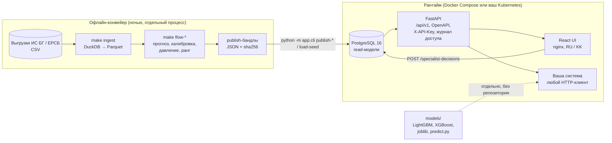

# Интеграция в контур заказчика

Как встроить Aqyl Kezek (hospital-queue-ai) в существующую систему: как сервис, как набор ML-модулей или как
данные. Документ для технической команды ведомства и оператора (НИТ). Остальная документация в `docs/` на
английском; API описан в [api.md](api.md), схема данных в [data.md](data.md), безопасность в [security.md](security.md).

## Что внутри



Границы, которые держатся тестами и аудитом: backend не импортирует ML-код, ML не запускается в HTTP-запросе,
схема базы меняется только миграциями Alembic, ИИ-ассистент вызывается только через серверный прокси.

## Способ 1. Как сервис рядом с вашими системами

Пакет поставки (всё в репозитории, без LFS и внешних ссылок; [ADR 0007](adr/0007-committed-release-data.md)):

- два образа, собираемых из `backend/Dockerfile` и `frontend/Dockerfile` (`hqai-backend`: FastAPI + Alembic;
  `hqai-frontend`: nginx со статикой и прокси `/api`), `docker-compose.yml`, `.env.example`, `Makefile`;
- PostgreSQL 16 и схема, которой владеет только Alembic (`backend/alembic/versions`, применяется при старте
  контейнера); подойдёт и база под управлением вашего DBA начиная с версии 14;
- `seed/` (30 МБ): три опубликованных свидетельства байт в байт, национальные таблицы для экрана и срез
  направлений по двум регионам, `manifest.json` с sha256 каждого файла; загрузчик `python -m app.cli load-seed`;
- `models/` (81 МБ): шесть замороженных моделей как самостоятельные модули (см. способ 2);
- контракт API `backend/openapi.json` и сгенерированные типы TypeScript; документация в `docs/`; аудит
  `tools/audit.py` (архитектура, контракт OpenAPI, миграции, тесты, секреты, фронтенд), который CI запускает на
  каждый push вместе с заданием `demo-seed` (свежая база ← `seed/` ← smoke-тест).

```bash
git clone <repo> && cd hospital-queue-ai
make demo              # .env со случайными паролем и демо-ключом, контейнеры, загрузка seed/
open http://localhost:3000        # интерфейс
open http://localhost:8000/docs   # OpenAPI, 38 операций
```

`make demo` = `make env` (создаёт `.env`, существующий не трогает) → `make up` → `docker compose --profile demo run
--rm seed`. Сервис `seed` есть только в профиле `demo`: обычный `make up` данные не трогает. После
`docker compose down -v` база заполняется заново той же командой `docker compose --profile demo run --rm seed`.
Синтетический слой интерфейса (очередь Н-####, симуляция дня, сценарии) целиком лежит в `frontend/src/synthetic/` и
отключается сборкой `make web-build-off` (`VITE_SYNTHETIC=off`); в опубликованные прогнозы, пороги и уровни он не
попадает.

Интеграция по HTTP: контракт зафиксирован в `backend/openapi.json` (каждая операция имеет стабильный `operationId`;
CI проверяет, что снимок совпадает с приложением). Ключ передаётся в заголовке `X-API-Key`; роли `viewer`,
`specialist`, `admin`. Ключи создаются командой `make create-key ROLE=… LABEL=…` или через `POST /admin/keys`;
хранятся только хеши. Каждое обращение пишется в `access_log`.

Основные операции для внешней системы:

| Что нужно | Операция |
|---|---|
| Сигналы давления потока с рангом, уровнем, датой превышения, объяснением | `GET /api/v1/operational-intelligence/signals`, `…/signals/{id}`, `…/signals/{id}/explanation` |
| Прогноз p10 / p50 / p90 на 14 дней по потоку | `GET /api/v1/operational-intelligence/forecasts` |
| Сводка по стране и региону | `…/overview`, `…/regions/{code}`, `…/hospitals/{org}/profiles/{profile}` |
| Стресс-тест и математические альтернативы по сигналу | `GET /api/v1/review-evidence/signals/{id}/stress-test`, `…/decision-alternatives` |
| Паспорт модели с хешами | `GET /api/v1/model-assurance`, `…/capabilities` |
| Решение специалиста (запись, идемпотентно) | `POST /api/v1/specialist-decisions`, `GET …` |
| Справочники (регионы, стационары, профили) | `GET /api/v1/dictionaries` |

### Ночной пересчёт при живой выгрузке

Отдельный процесс вне контейнеров API (Python 3.12+, `ml/`), запускается планировщиком контура; в HTTP-запросе ML
не выполняется. Шаги:

1. `make ingest` — новые CSV с теми же заголовками, что в `ml/configs/ingest.yaml`, → `data/processed/*.parquet` →
   факты и агрегаты в PostgreSQL (валидация и нормализация описаны в [data.md](data.md)).
2. `make flow-quantile` → `make flow-calibration` → `make flow-hierarchy` → `make flow-pressure` →
   `make signal-prioritization` — прогноз p10/p50/p90, калибровка интервалов, иерархия, давление потока по
   `historical_flow_proxy_v1`, ранг сигналов. Каждый запуск пишет `artifacts/runs/<run-id>/run.json` с хешами и
   возобновляется после обрыва (`ARGS="--resume <run-id>"`).
3. `make flow-scenario` → `make decision-alternatives` — стресс-тест и математические альтернативы для
   review-свидетельств (только `EVALUATION`, `human_review_required = true`).
4. `make operational-intelligence-bundle` и `make review-evidence-bundle` — проекция принятых запусков в JSON с
   версией схемы и хешами. Начало прогноза (origin) и идентификаторы принятых запусков сегодня заданы константами в
   `tools/operational_bundle.py` (`ORIGIN`, `SOURCES`); новый origin означает новые принятые запуски и правку этих
   констант, флага командной строки для origin пока нет. Инструмент проверяет, что все запуски согласованы по origin,
   иначе отказывает.
5. `make operational-intelligence-publish BUNDLE=…`, затем `make review-evidence-publish BUNDLE=…` (и
   `make assurance-publish BUNDLE=…` при новом паспорте) — валидация и публикация одной транзакцией: новая версия
   активируется, старая остаётся в базе; идентичность считается от содержимого.
6. `make predict` — предсказания текущих моделей A/B/C в `pred_*`, `model_registry` и пересборка `mart_*` (нужны
   национальные факты; на базе, заполненной из `seed/`, этот шаг не запускать — там срез по двум регионам).

Переобучение (`make train`, `make tournament`) в ночной цикл не входит: модели заморожены, продвижение новой версии
делает человек (`ARGS="--promote"`), после чего `make models-export` пересобирает `models/`.

Что должен добавить контур (подробно в [security.md](security.md) §4): TLS перед nginx, SSO ведомства вместо
демо-ключа, менеджер секретов вместо `.env`, отдельные роли Postgres, вынос журнала в SIEM, запрет публикации
портов 5432/8000 наружу. Интернет в рантайме не нужен; ассистент опционален и переключается на модель внутри
страны одной настройкой (`ASSISTANT_BASE_URL`, `ASSISTANT_MODEL`, `ASSISTANT_API_KEY`) или отключается.

## Способ 2. Как ML-модули в вашем коде

Папка `models/` самодостаточна: её можно скачать отдельно от репозитория. В каждой подпапке модель в родном
формате (LightGBM `model*.txt`, XGBoost `model.json`), `bundle.joblib` (кроме `flow_quantile` — это проверенный
повторный расчёт, а не копия артефакта), `features.json`, `categories.json`, `meta.json`, `metrics.json`, пример
входа `example.csv.gz` и ожидаемый выход `example_expected.csv.gz`, `predict.py` и README. Зависимости только
`lightgbm`/`xgboost`, `pandas`, `numpy`; Python 3.10+. Индекс моделей и метрики: [`models/README.md`](../models/README.md).

Из командной строки (CSV → CSV; категориальные коды читаются как текст, `0011` не теряет нули):

```bash
python models/refusal_risk/predict.py --input referrals.csv --output scored.csv
```

Из кода — через API модуля, а не через `booster.predict` напрямую: `predict.py` сам приводит категории к текстовым
кодам обучения и делает обратное преобразование выхода (например, `wait_time` предсказывает `log1p(дней)` и
возвращает дни).

```python
import sys, joblib, pandas as pd
sys.path.insert(0, "models/refusal_risk")
from predict import from_bundle, load, predict, read_input

model = load()                                        # родной файл + features.json, categories.json
df = read_input("referrals.csv", model)               # колонки из features.json, коды категорий как текст
scored = predict(df, model)                           # DataFrame с колонкой предсказания, индекс как у df
scored = predict(df, from_bundle(joblib.load("models/refusal_risk/bundle.joblib")))  # то же из bundle.joblib
```

Каждый файл имеет sha256 в `models/manifest.json`: файл с другим хешем — другая модель. Версия и идентичность
совпадают с записью в паспорте (`model-assurance-6b5-v1`). Признаки описаны в README модели и в
[model_card.md](model_card.md); утечки исключены по правилу «известно к началу дня прогноза». Модели заморожены:
файлы в `models/` не правятся руками, их пересобирает `ml/pipelines/export_models.py` (`make models-export`) из
проверенных по хешам `artifacts/`; переобучение — `make train` / `make tournament` с явным продвижением человеком.

## Способ 3. Как данные в вашу базу

Публикации — обычный JSON с версией схемы и хешами, их можно грузить в любую базу без нашего кода:

| Файл | Схема | Содержимое |
|---|---|---|
| `seed/model_assurance.json` | `model_assurance_v1` ([JSON Schema](model-assurance-contract-v1.schema.json)) | 13 возможностей, вердикты, идентичности |
| `seed/operational_intelligence.json.gz` | `operational_intelligence_v1` | 225 680 строк прогноза, 4 194 сигнала, провенанс |
| `seed/review_evidence.json.gz` | `review_evidence_v1` | 4 сценария стресс-теста, 141 176 ячеек, 460 наборов альтернатив |

Загрузка в свой PostgreSQL 16 (обе команды выполняются из каталога `backend/`, переменные `POSTGRES_*` из `.env`):

```bash
cd backend
alembic upgrade head
python -m app.cli load-seed --dir ../seed        # или абсолютный путь; --replace очищает ранее засеянные таблицы
```

Загрузчик проверяет sha256 каждого файла по `seed/manifest.json`, грузит таблицы одной транзакцией и публикует три
свидетельства через те же сервисы, что и `make *-publish`; ключи, журнал доступа и решения специалистов не трогает,
на непустой базе без `--replace` отказывает. Идентичности публикаций (`publication_identity_sha256`) считаются от
содержимого и не зависят от даты загрузки, поэтому цифры на экране совпадают с цифрами в паспорте и в презентации.
Схемы таблиц — в [data.md](data.md); формат CSV: `COPY … (FORMAT csv, HEADER true)`, gzip, порядок по первичному
ключу.

Входной контракт для живой выгрузки: те же файлы, что выдаёт ИС БГ (направления, ожидающие, отказы приёмного) и
ЕРСБ, с заголовками из `ml/hqai_ml/ingest/sources.py`; преобразование в таблицы описано в [data.md](data.md).
Персональные данные не нужны: имена и ИИН в исходных наборах отсутствуют, конвейер их не ожидает.

## Что не входит в поставку

Сырые данные Минздрава (16 ГБ, выдаются организаторами), артефакты экспериментов (1,3 ГБ, воспроизводятся
конвейером по хешам), ключи провайдера ИИ. Система не назначает и не перенаправляет пациентов, не считает койки
и не действует без человека: у каждой возможности в паспорте `human_review_required = true`.
